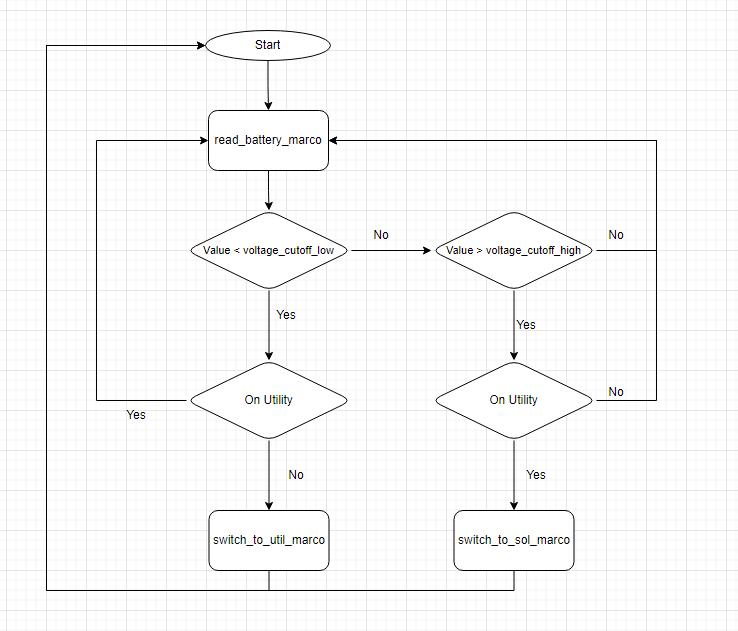

### How to run

#### Using exe:
1. Update config.json file based on your environment and needs
   1. Refer "Understanding config.json" section for details
   2. The location of config.json is "dist/RPA_Event_Loop/config.json"
2. Execute the program "RPA_Event_Loop.exe"
   1. Tge the easiest way to do this to double clik on RPA_Event_Loop.exe
   2. In case you need to check logs then 
      1. Open CMD and change the directory to <>/RPA_Event_Loop/
         1. This step is mandatory 
         2. Executing the exe using /RPA_Event_Loop/RPA_Event_Loop.exe when current working dir is not /RPA_Event_Loop/ will cause an error
      2. Start the exe

#### Using Source Code:

1. Install python 3.13 or above
2. Open a CMD and change directory to RPA_Loop project 
3. run "pip install -r .\requirements.txt"
4. Update config.json file based on your environment and needs
   1. Refer "Understanding config.json" section for details
   2. The location of config.json is "src/config.json"
5. execute "src/main.py"

### Understanding config.json

File contains various configurables for the program. Each of these is defined under 

1. **read_battery_marco**: This is the location of the read_battery_marco in Ui.Vision macro inventory.
2. **switch_to_util_marco**: This is the location of the switch_to_util_marco in Ui.Vision macro inventory.
3. **switch_to_sol_marco**: This is the location of the switch_to_sol_marco in Ui.Vision macro inventory.
2. **path_autorun_html**: This is the location where your ui.vision.html stored. The value must be a fully qualified path to a file.
3. **browser_path**: This is the location where your browser binary stored. The value must be a fully qualified path to a file.
4. **voltage_cutoff_low**: This is low cutoff value. When the output of read_battery_marco is less than this value switch_to_util_marco will execute.
5. **voltage_cutoff_high**: This is high cutoff value. When the output of read_battery_marco is greater than this value switch_to_sol_marco will execute.
4. **timeout_seconds**: This is timeout value for a macro execution. If the longest running marco out of 1,2,3 takes x second to execute set this value to x+10.
5. **wait_interval**: Wait time between the execution of the flow in seconds. If you want the flow to run every 5 minutes set this to 300.
6. **num_executions**: Number of times the flow should be executed. Set to 0 for an infinite loop.
7. **log_location**: Location where you would like to store the logs.

### Sample config.json
```
{
  "read_battery_marco" : "read_battery_marco",
  "switch_to_util_marco" : "switch_to_util_marco",
  "switch_to_sol_marco" : "switch_to_sol_marco",
  "path_autorun_html" : "C:\\ui_vision\\ui.vision.html",
  "browser_path" : "C:\\Program Files (x86)\\Microsoft\\Edge\\Application\\msedge.exe",
  "voltage_cutoff_low": 50,
  "voltage_cutoff_high": 80,
  "timeout_seconds" : 10,
  "wait_interval" : 300,
  "num_executions" : 0,
  "log_location" : "C:\\ui_vision\\logs" 
}
```

### Logical Flow of the code
